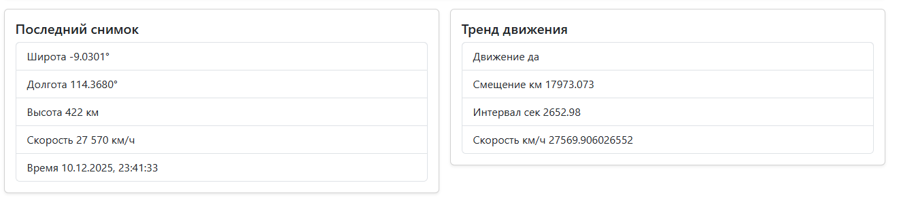
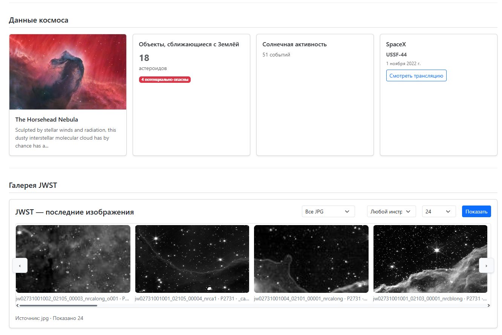
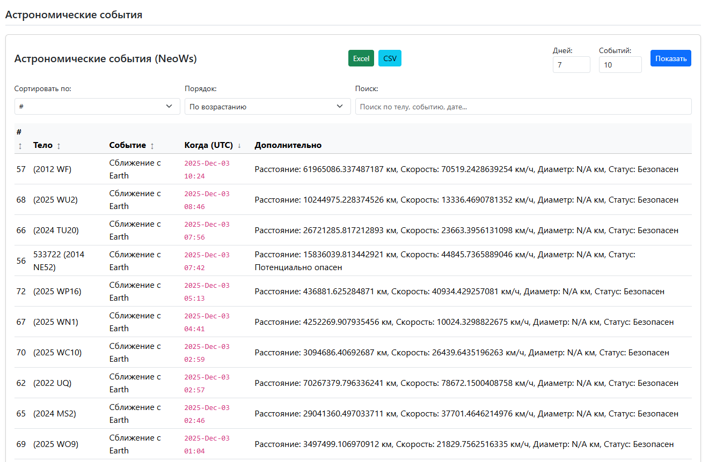
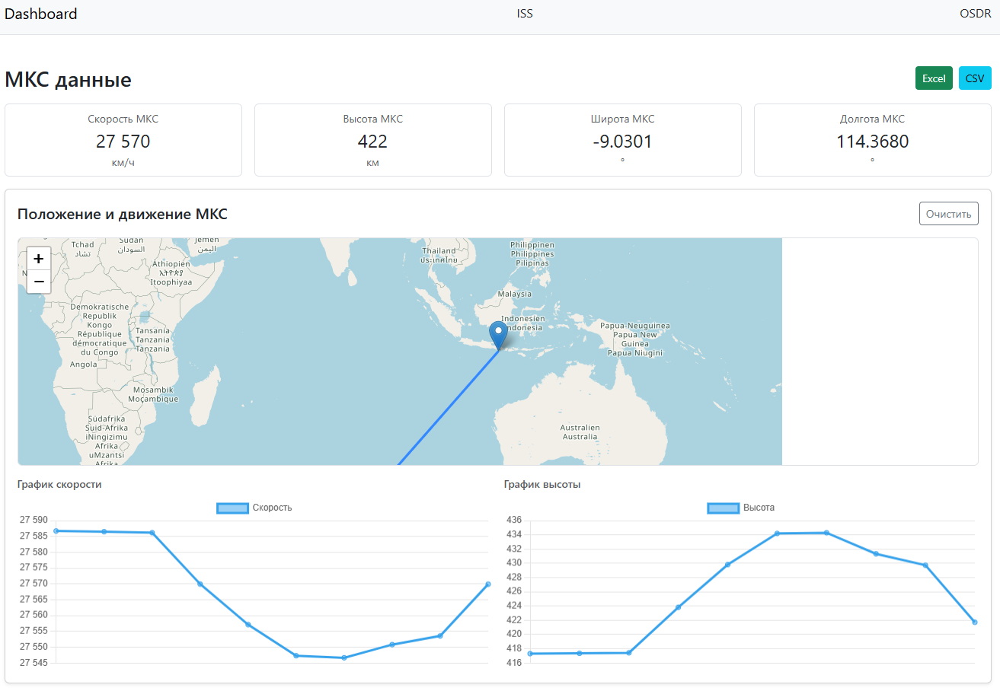
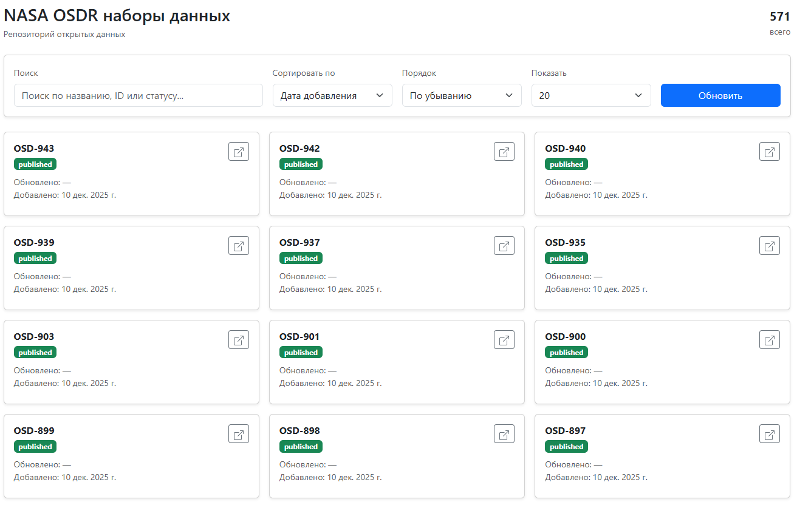

# Space Dashboard Project

Проект для сбора и визуализации космических данных на стеке FastAPI + Next.js. Система обеспечивает сбор, обработку и отображение данных с Международной космической станции, обсерватории JWST, астрономических событий и телеметрических данных.

## Структура проекта

- `services/fastapi-backend` - FastAPI бэкенд сервис на Python 3.11
- `services/nextjs-frontend` - Next.js 14 фронтенд приложение на React и TypeScript
- `services/pascal-legacy` - Legacy Pascal утилита для генерации телеметрических данных
- `services/nginx` - Nginx reverse proxy
- `services/redis` - Redis кэш для оптимизации производительности
- `db` - PostgreSQL база данных с поддержкой TIMESTAMPTZ

## Технологический стек

Проект был мигрирован с Rust (Axum) и Laravel на современный стек. Backend использует FastAPI с SQLAlchemy (asyncpg) для асинхронной работы с базой данных и Pydantic для валидации данных. Frontend построен на Next.js 14 с TypeScript и SCSS для стилизации. Все сервисы контейнеризированы через Docker Compose и собираются с нуля из исходных зависимостей.

Архитектура бэкенда следует принципам Clean Architecture с разделением на слои: конфигурация, состояние приложения с dependency injection, репозитории для работы с БД, сервисы для бизнес-логики и обработчики запросов. Используется Repository Pattern для защиты от SQL-инъекций и централизованной работы с данными. Для предотвращения дубликатов реализован Upsert по бизнес-ключам, а для контроля конкурентности - PostgreSQL Advisory Locks.

Frontend разделен на отдельные страницы: dashboard, ISS, OSDR, telemetry и astronomy. Каждая страница имеет собственную логику и компоненты, инкапсулированную в React Contexts (DashboardContext, IssContext, OsdrContext) для разделения бизнес-логики. Реализованы гибкие дашборды с фильтрацией по возрастанию и убыванию, выбором столбцов, фильтрацией по дате и поиском по ключевым словам. Стилизация выполнена на SCSS с использованием переменных, миксинов и вложенности для централизованного управления дизайном. Добавлены CSS анимации (fadeIn, slideIn, transitions) для улучшения пользовательского опыта. Реализованы переиспользуемые компоненты (IssMetricCard) для унификации отображения метрик. Поддержка экспорта данных в CSV и Excel форматы с корректным форматированием типов данных.

## Функциональность

Система поддерживает сбор и визуализацию данных с нескольких источников. ISS модуль отображает последние данные о станции, тренды с картой и графиками, метрики (скорость, высота, широта, долгота) в переиспользуемых компонентах. Поддерживается экспорт данных ISS в CSV и Excel форматы. OSDR модуль обеспечивает синхронизацию данных и их отображение в таблице с расширенной фильтрацией, сортировкой и поиском по всем наборам данных через backend search. JWST модуль предоставляет галерею изображений с проксированием для обхода CORS ограничений. Astronomy модуль интегрирован с NASA API для получения данных о околоземных объектах с возможностью экспорта в CSV и Excel, фильтрацией и сортировкой по столбцам. Telemetry модуль генерирует телеметрические данные в формате CSV с визуализацией в таблице. Все данные кэшируются в Redis для снижения нагрузки на базу данных и внешние API.

Dashboard страница организована в логические секции: метрики МКС, визуализация МКС (карта и графики), данные космоса (APOD, NEO, Солнечная активность, SpaceX), галерея JWST и астрономические события. Каждая секция имеет четкую структуру и визуальные разделители для улучшения навигации.

Legacy Pascal модуль работает как отдельный сервис в Docker контейнере. Он генерирует телеметрические данные в формате CSV и загружает их в таблицу `telemetry_legacy` в PostgreSQL. FastAPI бэкенд читает эти данные через TelemetryRepo и предоставляет их через API для отображения на фронтенде. Данные сохраняются с корректной типизацией: TIMESTAMPTZ для дат, NUMERIC для чисел и TEXT для строковых значений.

## Быстрый старт

1. Скопируйте `.env.example` в `.env` и настройте переменные окружения:
```bash
cp .env.example .env
```

2. Запустите все сервисы через Docker Compose:
```bash
docker-compose up -d
```

3. Откройте браузер и перейдите на `http://localhost:8080`

Все сервисы собираются с нуля: FastAPI бэкенд из Python 3.11 и requirements.txt, Next.js фронтенд из package.json, PostgreSQL инициализируется через init.sql, Redis использует готовый образ, а Nginx настраивается из конфигурационного файла.

## Переменные окружения

Основные переменные описаны в `.env.example`. Обязательно настройте:
- `POSTGRES_PASSWORD` - пароль для PostgreSQL
- `NASA_API_KEY` - ключ для NASA API (если используется)
- `JWST_API_KEY` - ключ для JWST API
- `ASTRO_APP_ID` и `ASTRO_APP_SECRET` - для Astronomy API

Секреты хранятся в `.env` файле и передаются через Docker Compose, никогда не коммитятся в код.

## Порты

- `8080` - Nginx (основной веб-интерфейс)
- `3000` - Next.js фронтенд
- `8081` - FastAPI бэкенд
- `5432` - PostgreSQL
- `6379` - Redis

## Архитектура бэкенда

Структура бэкенда организована по принципам Clean Architecture. Основные директории: `config` для конфигурации и настроек, `state` для состояния приложения с dependency injection через AppState и интеграцией Redis клиента, `database` для подключения к БД и миграций, `domain` для Pydantic моделей, `schemas` для валидационных схем, `clients` для HTTP клиентов внешних API, `repo` для репозиториев работы с данными, `services` для бизнес-логики, `handlers` для обработчиков запросов, `routes` для маршрутов API, `middleware` для rate limiting и обработки ошибок, `utils` для утилитарных классов валидации.

Используется Repository Pattern, что исключает прямые SQL запросы в обработчиках и обеспечивает централизованную работу с базой данных. Все операции с данными проходят через репозитории, что упрощает тестирование и поддержку. Для предотвращения дубликатов данных реализован Upsert по бизнес-ключам вместо простых INSERT операций. Rate limiting применяется через декораторы `@limiter.limit()` на всех API endpoints с использованием Redis для хранения счетчиков запросов. Класс `Validators` предоставляет статические методы для валидации и извлечения данных различных типов, обеспечивая единообразную обработку по всему приложению.

## Безопасность и производительность

Система использует Pydantic для валидации всех входных параметров на уровне API. SQLAlchemy ORM защищает от SQL-инъекций, а данные санитизируются через Pydantic схемы. CORS настроен через middleware FastAPI. Rate-limiting реализован на двух уровнях: на фронтенде через in-memory хранилище для Next.js API routes и на бэкенде через slowapi с Redis storage для FastAPI endpoints. Каждый endpoint имеет индивидуальные лимиты запросов (ISS: 30/min, OSDR: 20/min, Astronomy: 50/min, JWST: 40/min, Telemetry: 60/min, CMS: 30/min, Space: 100/min). PostgreSQL advisory locks используются для фоновых задач, что предотвращает race conditions при параллельном выполнении.

Для валидации данных создан класс `Validators` с методами для извлечения и проверки чисел, строк, дат, вычисления расстояний и валидации параметров запросов. Это обеспечивает единообразную обработку данных по всему приложению.

Для оптимизации производительности используется Redis кэширование часто запрашиваемых данных по паттерну Cache-Aside, асинхронные операции через async/await для неблокирующей работы, connection pooling для PostgreSQL для эффективного использования соединений, индексы в базе данных для быстрого поиска и ленивая загрузка данных на фронтенде для улучшения времени отклика интерфейса.

## Разработка

### Локальная разработка фронтенда

```bash
cd services/nextjs-frontend
npm install
npm run dev
```

Фронтенд будет доступен на `http://localhost:3000`. Используется Next.js 14 с поддержкой hot reload.

### Локальная разработка бэкенда

```bash
cd services/fastapi-backend
pip install -r requirements.txt
uvicorn main:app --reload
```

Бэкенд будет доступен на `http://localhost:8081`. API документация доступна по адресу `/docs` (Swagger UI) и `/redoc` (ReDoc).

## Сборка

Все сервисы собираются через Docker Compose. Для пересборки:

```bash
docker-compose build
docker-compose up -d
```

При сборке все зависимости устанавливаются заново, что гарантирует воспроизводимость окружения.

## Логи

Просмотр логов всех сервисов:
```bash
docker-compose logs -f
```

Просмотр логов конкретного сервиса:
```bash
docker-compose logs -f fastapi-backend
docker-compose logs -f nextjs-frontend
docker-compose logs -f nginx
docker-compose logs -f redis
docker-compose logs -f postgres
```

### Экспорт данных

Экспорт в CSV и Excel использует специальное форматирование:
- Timestamps конвертируются в ISO 8601 формат
- Booleans преобразуются в "ИСТИНА"/"ЛОЖЬ" для CSV и в boolean значения для Excel
- Numbers сохраняются как числовые типы в Excel для корректной работы формул
- Строки экранируются при необходимости (кавычки, запятые, переносы строк)

### Rate Limiting

Двухуровневая система:
- **Frontend**: in-memory хранилище для Next.js API routes, очистка старых записей по вероятности
- **Backend**: Redis storage для FastAPI, персистентное хранение счетчиков между перезапусками

Оба уровня используют IP-адрес клиента для идентификации. При превышении лимита возвращается HTTP 429 с заголовком `Retry-After`.

## Рефакторинг проекта

### Состав модулей до рефакторинга

До миграции проект использовал монолитную архитектуру на Rust (Axum) с SQLx для работы с базой данных. Frontend был построен на Laravel с PHP и Blade шаблонами, использовался Bootstrap для стилизации. Legacy модуль работал как отдельный Pascal процесс, генерирующий CSV файлы. Структура была монолитной с прямыми SQL запросами в обработчиках, отсутствовали слои абстракции и типизация данных на уровне валидации.

### Состав модулей после рефакторинга

После миграции проект переведен на микросервисную архитектуру с четким разделением ответственности. Backend на FastAPI с SQLAlchemy (asyncpg) для асинхронной работы, Pydantic для валидации. Frontend на Next.js 14 с TypeScript и SCSS. Legacy Pascal модуль сохранен как отдельный сервис для обратной совместимости. Архитектура следует принципам Clean Architecture с разделением на слои: конфигурация, состояние, репозитории, сервисы, обработчики и маршруты. Все сервисы контейнеризированы через Docker Compose.

### Анализ рефакторинга по модулям

| Модуль | Проблема | Решение | Паттерн | Эффект |
|--------|----------|---------|---------|--------|
| Backend | Rust сложен для поддержки, нет типизации данных на уровне API | Миграция на FastAPI с Pydantic валидацией, Clean Architecture | Clean Architecture, Repository Pattern | Упрощение поддержки, автоматическая валидация, меньше ошибок, легче тестировать |
| Frontend | Laravel Blade смешивает логику и представление, низкая производительность | Next.js с разделением на страницы и компоненты, TypeScript | Component-based Architecture | Чистый код, переиспользование компонентов, лучшая производительность, SSR |
| Database | Прямые SQL запросы, нет типизации дат, дубликаты данных | Репозитории с TIMESTAMPTZ, Upsert по бизнес-ключам | Repository Pattern, Upsert Pattern | Защита от SQL-инъекций, корректная работа с датами, предотвращение дубликатов |
| Legacy | Pascal модуль сложен в поддержке, изолирован от основной системы | Сохранен как отдельный сервис, интегрирован через БД | Service Layer Pattern | Обратная совместимость, единый стек для основной системы |
| API Integration | Нет обработки ошибок, таймауты, нестабильность | Клиенты с retry логикой, обработка ошибок, кэширование | Circuit Breaker (частично), Error Handling | Стабильность при сбоях внешних API, снижение нагрузки |
| Concurrency | Race conditions в фоновых задачах, параллельное выполнение | PostgreSQL Advisory Locks для синхронизации | Advisory Lock Pattern | Предотвращение параллельного выполнения задач, целостность данных |
| Caching | Нет кэширования, высокая нагрузка на БД и внешние API | Redis для кэширования данных по паттерну Cache-Aside | Cache-Aside Pattern | Снижение нагрузки на БД и внешние API, улучшение времени отклика |

### Выводы

Ключевые улучшения, которые реально повлияли на систему:

**Миграция на FastAPI + Next.js** - упростила поддержку кода и улучшила производительность. FastAPI с автоматической валидацией через Pydantic снизил количество ошибок на этапе разработки. Next.js с SSR улучшил время первой загрузки страниц. Реализация: `services/fastapi-backend/` и `services/nextjs-frontend/`.

**Clean Architecture с Repository Pattern** - код стал более структурированным и тестируемым. Разделение на слои упростило понимание структуры проекта. Репозитории защищают от SQL-инъекций и централизуют работу с БД. Реализация: `services/fastapi-backend/app/repo/`, `services/fastapi-backend/app/services/`, `services/fastapi-backend/app/handlers/`.

**Upsert по бизнес-ключам** - предотвращение дубликатов данных стало надежным и предсказуемым. Особенно важно для OSDR данных, где используется уникальный индекс по `dataset_id`. Реализация: `services/fastapi-backend/app/repo/osdr_repo.py`, `services/fastapi-backend/app/database/connection.py`.

**PostgreSQL Advisory Locks** - решили проблемы concurrency в фоновых задачах. Предотвращают параллельное выполнение scheduler задач, что критично для синхронизации данных. Реализация: `services/fastapi-backend/app/utils/advisory_lock.py`.

**Redis кэширование** - снизило нагрузку на БД и внешние API. Cache-Aside паттерн обеспечивает актуальность данных при разумном использовании ресурсов. Реализация: `services/fastapi-backend/app/repo/cache_repo.py`, интеграция в `services/fastapi-backend/app/services/`.

**TIMESTAMPTZ для всех дат** - корректная работа с timezone во всех модулях. Решена проблема несоответствия дат при работе с разными часовыми поясами. Реализация: все таблицы в `services/fastapi-backend/app/database/connection.py` используют TIMESTAMPTZ.

**Rate Limiting с Redis** - двухуровневая защита от перегрузки: на фронтенде через in-memory хранилище для Next.js API routes и на бэкенде через slowapi с Redis storage. Каждый endpoint имеет индивидуальные лимиты в зависимости от нагрузки. Реализация: `services/nextjs-frontend/utils/rateLimit.ts`, `services/fastapi-backend/app/middleware/rate_limit.py`, применение на всех роутах в `services/fastapi-backend/app/routes/`.

**React Contexts для разделения логики** - бизнес-логика каждой страницы инкапсулирована в отдельные контексты (DashboardContext, IssContext, OsdrContext), что упрощает поддержку и тестирование. Реализация: `services/nextjs-frontend/contexts/`.

**Переиспользуемые компоненты** - унификация отображения метрик через компонент IssMetricCard, используемый на dashboard и ISS страницах. Реализация: `services/nextjs-frontend/components/IssMetricCard.tsx`.

**Экспорт данных в CSV/Excel** - поддержка экспорта астрономических событий и данных ISS в форматы CSV и Excel с корректным форматированием типов данных (timestamp, boolean, number, string). Реализация: `services/nextjs-frontend/utils/exportUtils.ts`.

**Класс Validators для валидации данных** - централизованная валидация и извлечение данных различных типов через статические методы класса Validators. Обеспечивает единообразную обработку данных по всему приложению. Реализация: `services/fastapi-backend/app/utils/validators.py`.

**Backend search для OSDR** - поиск по всем наборам данных OSDR выполняется на уровне базы данных, а не только по загруженным элементам. Поддерживает поиск по dataset_id, title, status и содержимому JSONB поля raw. Реализация: `services/fastapi-backend/app/repo/osdr_repo.py`.


### Интерфейс приложения

### Главная страница (Dashboard)

**URL:** `/dashboard`

Главная страница содержит обзор всех космических данных, организованных в логические секции.

#### Блок 1: Метрики МКС
Отображает четыре ключевые метрики Международной космической станции в виде карточек:
- **Скорость МКС** - текущая скорость в км/ч
- **Высота МКС** - текущая высота в км
- **Широта МКС** - текущая широта в градусах
- **Долгота МКС** - текущая долгота в градусах


#### Блок 2: Визуализация МКС
Интерактивная карта с отображением текущего положения и траектории движения МКС:
- **Карта Leaflet** - показывает текущую позицию станции с маркером и линией траектории
- **График скорости** - временной график изменения скорости МКС (Chart.js)
- **График высоты** - временной график изменения высоты МКС (Chart.js)
- **Кнопка "Очистить"** - полностью очищает данные из базы и начинает сбор заново

Карта и графики обновляются каждые 15 секунд, автоматически следуя за движением станции.


#### Блок 3: Последний снимок
Отображает последние полученные данные о МКС:
- Широта и долгота с точностью до 4 знаков после запятой
- Высота в километрах
- Скорость в км/ч
- Время получения данных


#### Блок 4: Тренд движения
Показывает расчетные параметры движения МКС:
- Статус движения (да/нет)
- Смещение в километрах
- Интервал времени в секундах
- Скорость тренда в км/ч



#### Блок 5: Данные космоса
Четыре карточки с информацией из различных источников:
- **APOD (Astronomy Picture of the Day)** - изображение дня от NASA с описанием
- **NEO (Near Earth Objects)** - количество астероидов, сближающихся с Землей сегодня, с указанием потенциально опасных
- **Солнечная активность** - количество солнечных вспышек (FLR) и выбросов корональной массы (CME)
- **SpaceX** - информация о ближайшем запуске SpaceX с датой и ссылкой на трансляцию

#### Блок 6: Галерея JWST
Интерактивная галерея изображений от космического телескопа Джеймса Уэбба:
- Фильтры по источнику (JPG, суффикс, программа)
- Выбор инструмента (NIRCam, MIRI, NIRISS, NIRSpec, FGS)
- Настройка количества изображений на странице (12, 24, 36, 48)
- Горизонтальная прокрутка с кнопками навигации
- Каждое изображение содержит подпись и ссылку на оригинал



#### Блок 7: Астрономические события (NeoWs)
Таблица с данными о околоземных объектах:
- Фильтры по количеству дней (1-7) и лимиту событий (1-1000)
- Сортировка по столбцам: номер, тело, событие, дата, дополнительная информация
- Поиск по ключевым словам
- Экспорт в CSV и Excel форматы
- Отображение полного JSON ответа в раскрывающемся блоке


---

### Страница МКС (ISS)

**URL:** `/iss`

Специализированная страница для детального мониторинга Международной космической станции.

#### Блок 1: Метрики МКС
Те же четыре карточки метрик, что и на главной странице:
- Скорость, высота, широта, долгота
- Автоматическое обновление каждые 15 секунд

#### Блок 2: Положение и движение МКС
Расширенная визуализация с картой и графиками:
- **Интерактивная карта** - показывает текущую позицию и траекторию движения
- **График скорости** - детальный график изменения скорости во времени
- **График высоты** - детальный график изменения высоты во времени
- **Кнопка "Очистить"** - очищает все данные из базы данных

#### Блок 3: Последний снимок
Детальная информация о последних данных МКС:
- Координаты с высокой точностью
- Высота и скорость
- Время получения данных

#### Блок 4: Тренд движения
Расчетные параметры движения:
- Статус движения
- Смещение и интервал
- Скорость тренда

#### Блок 5: Экспорт данных
Кнопки для экспорта всех данных МКС:
- **Экспорт в Excel** - создает файл с двумя листами: "Последние данные" и "Тренд движения"
- **Экспорт в CSV** - создает CSV файл с объединенными данными


---

### Страница OSDR

**URL:** `/osdr`

Страница для работы с наборами данных OSDR (Open Science Data Repository).

#### Блок 1: Фильтры и поиск
Панель управления данными:
- **Поиск** - поиск по всем наборам данных в базе (dataset_id, title, status, содержимое JSONB)
- **Лимит записей** - выбор количества отображаемых элементов (10, 20, 50, 100)
- **Сортировка** - выбор столбца и направления сортировки (по возрастанию/убыванию)

#### Блок 2: Таблица наборов данных
Интерактивная таблица с данными OSDR:
- Отображение основных полей: ID, dataset_id, title, status, даты
- Пагинация с навигацией по страницам
- Подсветка активной строки при наведении

#### Блок 3: Детальная информация
При клике на строку таблицы отображается:
- Полная структура данных в формате JSON
- Все поля набора данных
- Временные метки создания и обновления


---

## Документация

Основные файлы для изучения архитектуры:
- Backend структура: `services/fastapi-backend/app/`
  - Конфигурация: `app/config/settings.py`
  - Состояние приложения: `app/state/app_state.py`
  - Репозитории: `app/repo/`
  - Сервисы: `app/services/`
  - Обработчики: `app/handlers/`
  - Роуты: `app/routes/`
  - Middleware: `app/middleware/`
  - Утилиты: `app/utils/validators.py`
- Frontend структура: `services/nextjs-frontend/`
  - Страницы: `app/dashboard/`, `app/iss/`, `app/osdr/`
  - Контексты: `contexts/` (DashboardContext, IssContext, OsdrContext)
  - Компоненты: `components/` (IssMetricCard, DashboardScripts, IssMapScripts)
  - Утилиты: `utils/` (exportUtils, rateLimit)
  - Стили: `styles/` (dashboard.scss, iss.scss, osdr.scss)
  - Анимации: `animations/` (fadeIn, slideIn, transitions)
- Docker конфигурация: `docker-compose.yml`
- Конфигурация окружения: `.env.example`
- База данных: `db/init.sql`


